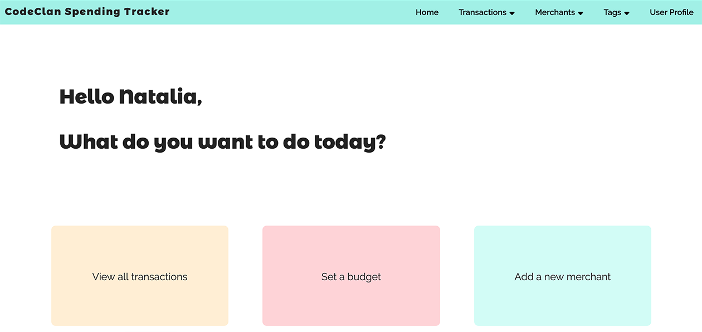
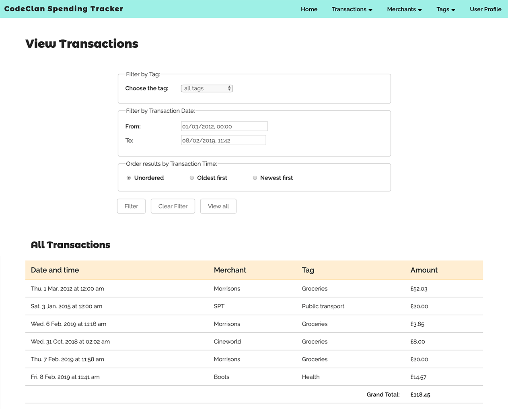

# CodeClan Ruby Project

Project specification: [Spending Tracker](Spending_tracker.md)

[Project Planning documents](./planning/planning_diagrams.md).

Homepage view.

All Transactions view.

## Technology

Ruby
Postgress
Sinatra
HTML5 and CSS3

No JavaScript.

## Notes

The project covers how an end user would use the **Spending Tracker** application, without taking into account authentication. Because of this, it is assumed that the user is already logged in.

While working on the project, the following scenarios needed further clarification:

* If there are transactions linked to a particular **merchant**, we should not be able to delete the merchant as those transactions have already taken place.
Because of this, the field `merchant_id` in the `merchants` table does not include `ON DELETE CASCADE`.

* In a similar scenario, if we want to delete a **tag** that has transactions linked to it, we should first allocate a different tag to those transactions.
This is being done from the `tag_controller` using the `reassing_tag.erb` view.
As a consequence of the above, if there is only one tag left, it will be linked to all the existing transactions and we will not be able to delete it unless we delete all the transactions first.

* Some accessibility features have been included and the website has been checked using the **tota11y** Chrome extension.
Despite this, there are still unfixed issues specially regarding submenu navigation and the opening of the collapsed menu for smaller screens.
